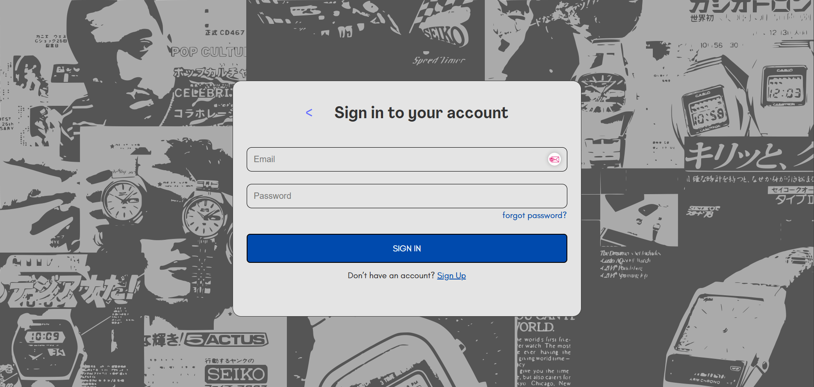
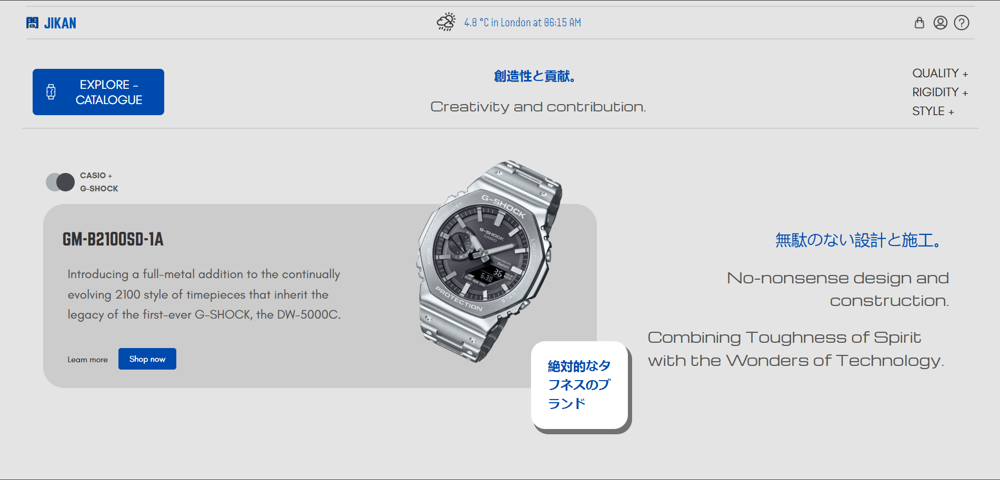
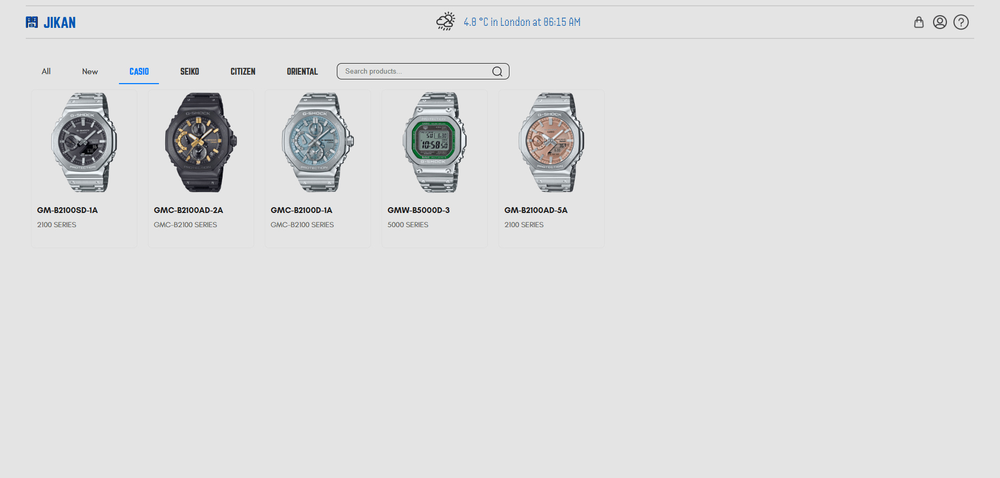

<div align="center">
  <a href="https://jikan-test.netlify.app">
    
  </a>
  <h2>Jikan</h2>
  <p align="center">
    <p>Elegant, Modern, and User-Friendly Watch E-commerce Platform</p>
  </p>
</div>

<div align="center">
  <a href="http://jikan-test.netlify.app">Live Demo</a>
</div>

## Jikan

A 100% Open-Source watch e-commerce platform designed to provide a seamless shopping experience.

### Motivation

The lack of non-physical watch focused shopping sites in certain countries is feeding into the dissapearence of watch culture internationally, Shopping for watches should be an enjoyable and hassle-free experience. Jikan aims to simplify the process by offering a comprehensive platform where users can browse, purchase, and manage their watch collections effortlessly.

### Key Features

- **Product Catalog**: Browse through a wide range of watches with detailed descriptions, high-quality images, and customer reviews.
- **Secure Checkout**: Ensure a safe and secure shopping experience with multiple payment options and encrypted transactions.
- **User Accounts**: Create and manage your personal account to track orders, save favorite items, and receive personalized recommendations.
- **Suggest Price**: Suggest a price for the item, the fill both your and seller's requirements for a better sale experience.
- **Admin Control**: Access dedicated admininstrator platform for any whole-site control or running development.

<details open>

<summary>More</summary>
  
  
  
  
</details>

### Under the Hood
- [**Vite**](https://vite.dev/guide/): A build tool that aims to provide a faster and leaner development experience for modern web projects.
- [**React**](https://reactjs.org/): A JavaScript library for building user interfaces, providing a robust foundation for creating dynamic and responsive web applications.
- [**Next.js**](https://nextjs.org/): A React framework that enables server-side rendering and static site generation, enhancing performance and SEO.
- [**Tailwind CSS**](https://tailwindcss.com/): A utility-first CSS framework for rapidly building custom user interfaces.

## Production Setup

### Managed Hosting

You can try [Vercel](https://vercel.com), a simple, user-friendly, and sophisticated platform to host your Next.js applications with ease.

It takes care of deployment, scaling, and performance optimization, allowing you to focus on building your application.

<div>
  <a href="https://vercel.com" target="_blank">
    <picture>
      <source media="(prefers-color-scheme: dark)" srcset="https://vercel.com/logo-dark.png">
      
    </picture>
  </a>
</div>

### Self-Hosted
#### Docker

Prerequisites: docker, docker-compose, git. Refer to [Docker Documentation](https://docs.docker.com) for more details on Docker setup.

Run the following commands:

```bash
git clone https://github.com/your-repo/jikan
cd jikan
docker-compose up -d
```

After a couple of minutes, the site should be accessible on your localhost port: 3000.

## Development Setup

### Manual Install

To set up the repository locally, follow the steps mentioned below:

1. Clone the repository:
   ```bash
   git clone https://github.com/your-repo/jikan
   cd jikan
   ```

2. Install dependencies:
   ```bash
   npm install
   ```

3. Start the development server:
   ```bash
   npm run dev
   ```

4. Open the URL `http://localhost:3000` in your browser, and you should see the application running.

## Learning and Community

1. [Next.js Documentation](https://nextjs.org/docs) - Learn everything about Next.js from the official documentation.
2. [React Documentation](https://react.dev/learn) - Extensive documentation for React.
3. [Tailwind CSS Documentation](https://tailwindcss.com/docs) - Comprehensive guide to using Tailwind CSS.
4. [Next.js GitHub Discussions](https://github.com/vercel/next.js/discussions) - Engage with the community of Next.js users and developers.

<br />
<br />
<div align="center" style="padding-top: 0.75rem;">
  <a href="https://your-website.com" target="_blank">
    <picture>
      <source media="(prefers-color-scheme: dark)" srcset="./public/jikan.png">
      
    </picture>
  </a>
</div>
